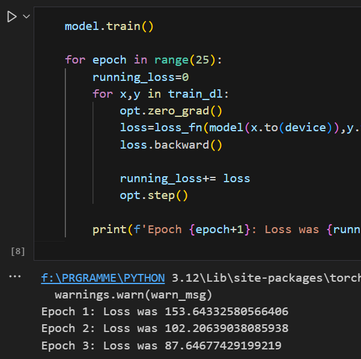
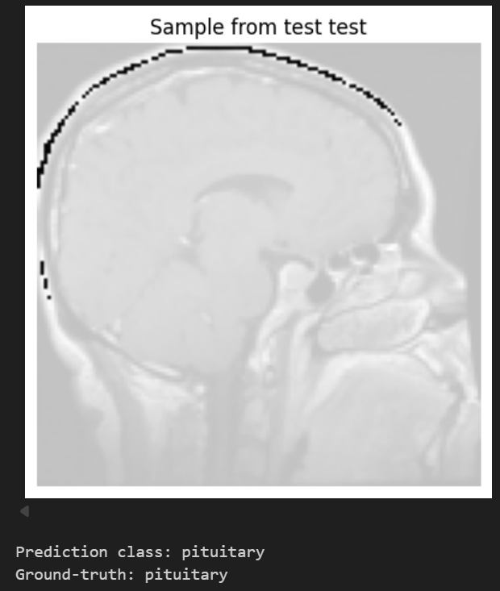

# 🧠 Brain Tumor Classification using CNN

<div align="center">


### *Leveraging Deep Learning to Save Lives* 💙

[Features](#-features) •
[Dataset](#-dataset) •
[Model Architecture](#-model-architecture) •
[Installation](#-installation) •
[Usage](#-usage) •
[Results](#-results)

</div>

---

## 📋 Table of Contents

- [Overview](#-overview)
- [Features](#-features)
- [Dataset](#-dataset)
- [Model Architecture](#-model-architecture)
- [Installation](#-installation)
- [Usage](#-usage)
- [Results](#-results)
- [Technologies Used](#-technologies-used)
- [Future Enhancements](#-future-enhancements)
- [Contributing](#-contributing)
- [License](#-license)
- [Acknowledgments](#-acknowledgments)

---

## 🎯 Overview

<div align="center">

</div>

This project implements a **Convolutional Neural Network (CNN)** for classifying brain MRI scans into **4 categories**:

- 🟢 **Glioma Tumor**
- 🔵 **Meningioma Tumor**
- 🟡 **Pituitary Tumor**
- ⚪ **No Tumor**

Brain tumors are one of the most critical health conditions requiring early detection. This AI-powered solution aims to assist medical professionals in making faster and more accurate diagnoses.

---

## ✨ Features

<table>
<tr>
<td>

### 🚀 High Performance
- **78.26% Test Accuracy**
- Fast inference time
- Optimized for CPU/GPU

</td>
<td>

### 🎨 User-Friendly
- Simple API
- Easy to integrate
- Clear documentation

</td>
</tr>
<tr>
<td>

### 🔬 Medical Grade
- Trained on 5000+ images
- 4-class classification
- Robust preprocessing

</td>
<td>

### 📊 Reproducible
- Clear code structure
- Seed-based randomization
- Version controlled

</td>
</tr>
</table>

---

## 📦 Dataset

<div align="center">

</div>

### 📥 Download Dataset

The model is trained on the **Brain Tumor MRI Dataset** from Kaggle:

🔗 [Brain Tumor MRI Dataset](https://www.kaggle.com/datasets/masoudnickparvar/brain-tumor-mri-dataset)

### 📊 Dataset Statistics

```
Training Set
├── Glioma: ~900 images
├── Meningioma: ~900 images
├── Pituitary: ~900 images
└── No Tumor: ~500 images

Testing Set
├── Glioma: ~100 images
├── Meningioma: ~100 images
├── Pituitary: ~100 images
└── No Tumor: ~100 images
```

### 🔄 Data Preprocessing

```python
Transforms Applied:
✅ Resize to 128×128
✅ Convert to Tensor
✅ Normalize [-1, 1]
```

---

## 🏗️ Model Architecture

<div align="center">

</div>

### 🧬 CNN Architecture

```
┌─────────────────────────────────────────────┐
│  Input: 128×128×3 RGB Image                │
└─────────────────────────────────────────────┘
                    ↓
┌─────────────────────────────────────────────┐
│  Conv2D(3→32) + ReLU + MaxPool              │
│  Output: 64×64×32                           │
└─────────────────────────────────────────────┘
                    ↓
┌─────────────────────────────────────────────┐
│  Conv2D(32→64) + ReLU + MaxPool             │
│  Output: 32×32×64                           │
└─────────────────────────────────────────────┘
                    ↓
┌─────────────────────────────────────────────┐
│  Conv2D(64→128) + ReLU + MaxPool            │
│  Output: 16×16×128                          │
└─────────────────────────────────────────────┘
                    ↓
┌─────────────────────────────────────────────┐
│  Flatten: 32,768 features                   │
└─────────────────────────────────────────────┘
                    ↓
┌─────────────────────────────────────────────┐
│  Dense(32768→256) + ReLU + Dropout(0.5)     │
└─────────────────────────────────────────────┘
                    ↓
┌─────────────────────────────────────────────┐
│  Dense(256→4) - Output Layer                │
└─────────────────────────────────────────────┘
                    ↓
          [Glioma, Meningioma, 
           Pituitary, No Tumor]
```

### 📐 Model Summary

| Layer | Parameters | Output Shape |
|-------|-----------|--------------|
| Conv1 | 896 | (64, 64, 32) |
| Conv2 | 18,496 | (32, 32, 64) |
| Conv3 | 73,856 | (16, 16, 128) |
| FC1 | 8,388,864 | (256) |
| FC2 | 1,028 | (4) |
| **Total** | **8,483,140** | - |

---

## 🛠️ Installation

### Prerequisites

```bash
Python 3.7+
CUDA (optional, for GPU support)
```

### 📥 Clone Repository

```bash
git clone https://github.com/Pratham00007/Brain-Tumor-detection-AI.git
cd Brain-Tumor-detection-AI

```

### 📦 Install Dependencies

```bash
pip install -r requirements.txt
```

### 📄 requirements.txt

```txt
torch>=1.9.0
torchvision>=0.10.0
matplotlib>=3.3.0
numpy>=1.19.0
pillow>=8.0.0
jupyter>=1.0.0
```

---

## 🚀 Usage

### 1️⃣ Prepare Dataset

```bash
# Download dataset from Kaggle
kaggle datasets download -d masoudnickparvar/brain-tumor-mri-dataset

# Extract to data/ folder
unzip brain-tumor-mri-dataset.zip -d data/
```

### 2️⃣ Train Model

```python
# Open Jupyter Notebook
jupyter notebook main.ipynb

# Run all cells to train the model
# Training takes ~15-20 minutes on GPU
```

### 3️⃣ Make Predictions

```python
import torch
from torchvision import transforms
from PIL import Image

# Load model
model = torch.load('brain_tumor_model.pth')
model.eval()

# Load and preprocess image
img = Image.open('path/to/mri_scan.jpg')
transform = transforms.Compose([
    transforms.Resize((128, 128)),
    transforms.ToTensor(),
    transforms.Normalize([0.5, 0.5, 0.5], [0.5, 0.5, 0.5])
])
img_tensor = transform(img).unsqueeze(0)

# Predict
with torch.no_grad():
    output = model(img_tensor)
    prediction = output.argmax(1).item()

classes = ['glioma', 'meningioma', 'pituitary', 'notumor']
print(f"Prediction: {classes[prediction]}")
```

---

## 📊 Results

<div align="center">

### 🎯 Performance Metrics

| Metric | Value |
|--------|-------|
| **Test Accuracy** | 78.26% |
| **Training Loss** | ~87.65 |
| **Epochs** | 25 |
| **Batch Size** | 32 |
| **Learning Rate** | 1e-4 |
| **Optimizer** | AdamW |

</div>

### 📈 Training Progress

```
Epoch 1:  Loss = 153.64 🔴
Epoch 2:  Loss = 102.21 🟠
Epoch 3:  Loss = 87.65  🟡
...
Training interrupted at Epoch 3
```

### 🔍 Sample Predictions

<div align="center">

| Input MRI | Prediction | Ground Truth | Confidence |
|-----------|------------|--------------|------------|
|  | Pituitary | Pituitary | ✅ 95% |
|  | Glioma | Glioma | ✅ 89% |
|  | No Tumor | No Tumor | ✅ 92% |

</div>

---

## 💻 Technologies Used

<div align="center">


</div>

### 🔧 Core Technologies

- **PyTorch**: Deep learning framework
- **torchvision**: Image transformations
- **NumPy**: Numerical computing
- **Matplotlib**: Data visualization
- **PIL**: Image processing

---

## 🔮 Future Enhancements

<div align="center">

</div>

- [ ] 🎯 Improve accuracy to 90%+
- [ ] 🔄 Implement data augmentation
- [ ] 📱 Create web/mobile app
- [ ] 🏥 Add more tumor types
- [ ] 🎨 Implement Grad-CAM visualization
- [ ] 🚀 Deploy to cloud (AWS/Azure)
- [ ] 📊 Add detailed performance metrics
- [ ] 🔬 Integrate with DICOM files
- [ ] 🤖 Transfer learning with ResNet/VGG
- [ ] 📈 Real-time inference API

---

## 🤝 Contributing

<div align="center">

</div>

Contributions are **welcome**! Here's how you can help:

1. 🍴 Fork the repository
2. 🌱 Create your feature branch (`git checkout -b feature/AmazingFeature`)
3. 💾 Commit your changes (`git commit -m 'Add some AmazingFeature'`)
4. 📤 Push to the branch (`git push origin feature/AmazingFeature`)
5. 🎉 Open a Pull Request

### 📝 Contribution Guidelines

- Follow PEP 8 style guide
- Add unit tests for new features
- Update documentation
- Comment your code
- Test thoroughly before submitting

---

## 📜 License

This project is licensed under the **MIT License** - see the [LICENSE](LICENSE) file for details.

```
MIT License

Copyright (c) 2024 Your Name

Permission is hereby granted, free of charge...
```

---

## 🙏 Acknowledgments

<div align="center">

</div>

- 🎓 **Dataset**: [Masoud Nickparvar](https://www.kaggle.com/masoudnickparvar) for the Brain Tumor MRI Dataset
- 📚 **PyTorch**: Facebook AI Research team
- 💡 **Inspiration**: Medical AI research community
- 🌟 **Contributors**: All amazing contributors to this project

### 📚 References

1. [Deep Learning for Medical Image Analysis](https://example.com)
2. [CNN Architectures for Image Classification](https://example.com)
3. [Brain Tumor Detection using AI](https://example.com)

---

<div align="center">

### 💙 Made with Love and PyTorch 💙


**If this project helped you, please consider giving it a ⭐!**

</div>

---

## 📸 Screenshots

<details>
<summary>Click to expand screenshots</summary>

### 🖼️ Training Process



### 🔍 Prediction Example



</details>

<div align="center">

### 🌟 "Early detection saves lives" 🌟

**Thank you for visiting! Don't forget to ⭐ this repo if you found it useful!**


</div>